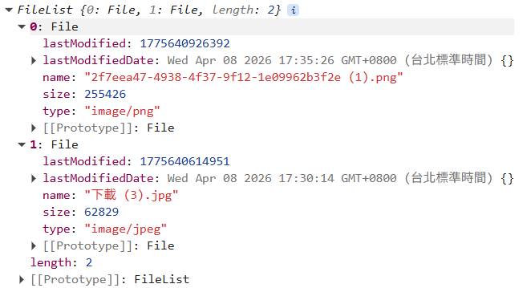

很久沒做上傳檔案的功能了，熊熊有點失憶，重新溫習一下 formData 的用法，還有點記憶的時候，寫個筆記。

## formData 是什麼?

`FormData` 是瀏覽器提供的一個物件，專門用來組「表單資料」，特別適合拿來送：

- 一般文字欄位
- 檔案
- 多檔上傳
- multipart/form-data 類型的 request

可以把它想成：把前端表單的每一個欄位，包成一份可以直接送給後端的資料袋。

### 為什麼要用 FormData

如果只是送一般 JSON，通常會這樣：

```js
axios.post('/api/user', {
  name: '阿明',
  age: 18
})
```

但如果你要送檔案，JSON 就不適合了，因為檔案不是普通字串。

這時候就要用 FormData。

### formData 最基本寫法
```js
const formData = new FormData();
formData.append('name', '阿明');
formData.append('age', '18');
```

這樣就等於組出一份表單資料：

```js
name = 阿明
age = 18
```

然後你可以把它送出去：
```js
axios.post('/api/test', formData);
```

### append 是什麼意思

append() 就是把一筆欄位加進去。

語法：
```
formData.append(欄位名稱, 欄位值)
```

例如：
```js
formData.append('userName', 'maru');
formData.append('note', '這是一筆測試資料');
```
### FormData 最常見用途：上傳檔案 

```HTML
<input type="file" id="fileInput">
```

```js
const fileInput = document.getElementById('fileInput');
const file = fileInput.files[0];

const formData = new FormData();
formData.append('file', file);

axios.post('/api/upload', formData);
```

這裡的意思是：

- fileInput.files[0] 取得使用者選的第一個檔案
- formData.append('file', file) 把檔案塞進表單資料
- 後端就可以用 file 這個欄位名稱接收它

### 多檔上傳怎麼用

```js
<input type="file" id="fileInput" multiple>
const files = document.getElementById('fileInput').files;
const formData = new FormData();

for (let i = 0; i < files.length; i++) {
  formData.append('files', files[i]);
}
```

這樣就是把多個檔案都放進同一個欄位 files 裡。

例如實際概念像這樣：

```js
files = a.pdf
files = b.jpg
files = c.png
```

後端通常就會把它當成一組檔案陣列來收。


### FormData 可以同時放文字和檔案
```js
const formData = new FormData();
formData.append('title', '我的附件');
formData.append('description', '這是上傳測試');
formData.append('file', file);
```

這樣送出去時，就會包含：

- title
- description
- file

所以它很適合這種情境：「送表單資料 + 附件」

### 為什麼它適合檔案上傳

因為 FormData 送出的資料格式通常是：`multipart/form-data`

這種格式就是專門設計來傳：

- 文字欄位
- 二進位檔案資料

所以 `<form enctype="multipart/form-data">` 的概念，跟 FormData 很接近。

### 可以從整個 form 直接建立

如果你本來就有 HTML form，也可以直接把整個表單轉成 FormData。

```HTML
<form id="myForm">
  <input type="text" name="userName" value="maru">
  <input type="file" name="avatar">
</form>
```
```JS
const form = document.getElementById('myForm');
const formData = new FormData(form);
```

這樣 form 裡有 name 的欄位都會自動被收進去。

### 怎麼查看 FormData 裡面有什麼

很多人一開始會這樣寫：
```js
console.log(formData);
```

但通常你不會直接看到裡面的內容。

要這樣看：
```js
for (const pair of formData.entries()) {
  console.log(pair[0], pair[1]);
}
```
例如可能會印出：
```js
userName popeye
note 測試
file File {...}
```

## 實作多檔上傳

畫面很簡單，只有 2 個元素，一個是上傳選擇框 fileInput，fileInput 記得要給 multiple 的屬性。

另一個是上傳按鈕 uploadBtn，綁定uploadBtn 的監聽。


```html
<input type="file" id="fileInput" multiple />
```

當點擊 uploadBtn 時觸發上傳動作，fileInput有files的屬性，我們把這個屬性附值給  `files` 常數。

```js
const files = fileInput.files;
```

`fileInput.files` 是一個物件，裡面的結構如下 ，會有檔案名稱，檔案大小及檔案類型，還有最後修改時間。



接下來使用 formData 的方法來夾檔。

```js
const formData = new FormData();

// 多檔上傳
for (let i = 0; i < files.length; i++) {
	formData.append('files', files[i]);
}

// 其他欄位也可以一起送
formData.append('userName', 'maru');
formData.append('description', '這是多檔上傳測試');
```

使用 axios 打 API 上傳時，`formData` 放在 url 的後方，當作一個參數，一起POST。

```js
axios.post(webhookUrl, formData, {
          headers: {
            'Content-Type': 'multipart/form-data'
          }
        });
```

```html
<!DOCTYPE html>
<html lang="zh-Hant">
<head>
  <meta charset="UTF-8" />
  <meta name="viewport" content="width=device-width, initial-scale=1.0" />
  <title>Webhook.site 多檔上傳測試</title>
  <script src="https://cdn.jsdelivr.net/npm/axios/dist/axios.min.js"></script>
</head>
<body>
  <h2>多檔上傳測試</h2>

  <input type="file" id="fileInput" multiple />
  <button id="uploadBtn">上傳到 Webhook.site</button>

  <script>
    const fileInput = document.getElementById('fileInput');
    const uploadBtn = document.getElementById('uploadBtn');

    // 換成你的 Webhook.site 專屬網址
    const webhookUrl = 'Webhook.site 專屬網址';

    uploadBtn.addEventListener('click', async () => {
      const files = fileInput.files;
      console.log(files)

      if (!files.length) {
        alert('請先選擇檔案');
        return;
      }

      const formData = new FormData();

      // 多檔上傳
      for (let i = 0; i < files.length; i++) {
        formData.append('files', files[i]);
      }

      // 其他欄位也可以一起送
      formData.append('userName', 'maru');
      formData.append('description', '這是多檔上傳測試');

      try {
        const response = await axios.post(webhookUrl, formData, {
          headers: {
            'Content-Type': 'multipart/form-data'
          }
        });

        console.log('上傳成功', response.data);
        alert('上傳成功，請到 Webhook.site 頁面查看 request');
      } catch (error) {
        console.error('上傳失敗', error);
        alert('上傳失敗，請看 console');
      }
    });
  </script>
</body>
</html>
```


## Webhook.site 使用方法

在這則筆記中，我使用 [Webhook.site](http://Webhook.site) 的服務來查看上傳的的結果，記得把進入網站時頁面上的專屬網址貼到 webhookUrl。

```html
// 換成你的 Webhook.site 專屬網址
    const webhookUrl = 'Webhook.site 專屬網址';
```

過程中可能會遇到 CORS 錯誤，此時點選右上角的 Edit，勾選 Add CORS headers，就可以解決。