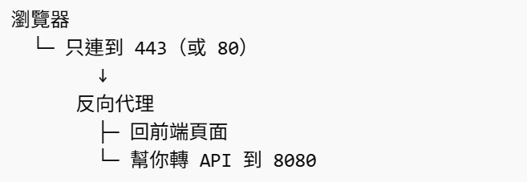

剛開始做前端開發時，在本地端常常打測試機的 API，postman 可以取得資料，但是在 IDE 中跑程式打 API 卻會遇到 CORS 錯誤。

剛開始莫名所以，後來才明白 CORS 不是後端 API 壞掉，也不是前端寫錯，而是瀏覽器的限制。主要是：瀏覽器為了安全，故意限制我們的前端 JS 不能隨便去讀別的來源的資料。

這個限制的基礎叫做 same-origin policy（同源政策）。MDN 對同源的定義是：*協定、主機、埠號* 三者都要一樣，才算同源；只要其中一個不同，就算不同源。

## 什麼叫「同源」？

假設前端頁面是從這裡開起來的：

```js
http://localhost:5173
```

這個網址其實可以拆成三塊：

- 協定：http
- 主機：localhost
- 埠號：5173

如果你的 API 是在：http://localhost:8080

它的：

- 協定：http
- 主機：localhost
- 埠號：8080

你會發現：

- 協定一樣
- 主機一樣
- **但埠號不一樣**

而 MDN 明確說過，只要埠號不同，就是不同源。

所以 `http://localhost:5173` 去呼叫 `http://localhost:8080` 就是跨來源請求。

## 為什麼瀏覽器要限制同源

瀏覽器到底在怕什麼？

我們可以把瀏覽器想成一個很神經質的保全。

它會想：

「這個在 localhost:5173 跑的 JavaScript，憑什麼去讀 localhost:8080 的資料？」
「如果我不管，那惡意網站是不是也能偷打別人的 API？」

所以瀏覽器有一條基本規則：

A 網站載入的 JS，不可以隨便讀 B 網站的資料。

這就是 same-origin policy 的精神。MDN 也指出，這是一個很重要的安全機制，用來限制不同來源文件之間的互動，降低惡意網站攻擊的風險。

## 為什麼前端程式部屬到主機上就沒有同源問題
### 開發時

你常見的是這樣：
```js
前端：http://localhost:5173
API：http://localhost:8080
```

這時瀏覽器真的看到兩個不同 origin，所以它會說：你跨來源了，要檢查 CORS。

### 部署後

很多網站其實是這樣運作：


瀏覽器看得到的只有外面這層，它只知道自己在呼叫：`https://example.com/api/users`，它不知道伺服器內部其實又轉送到：`http://127.0.0.1:8080/api/users`。

所以對瀏覽器來說，根本沒有跨來源。瀏覽器從頭到尾只接觸到一個 origin，所以沒有同源問題。不是「後端埠號消失」，而是「被藏起來了」。後端可能還是跑在：`http://127.0.0.1:8080`，只是這個位址不直接暴露給瀏覽器。瀏覽器只會碰到：`https://example.com/api/...`，後端的 8080 還在，但那是伺服器內部的事，不是瀏覽器直接連的位置。

對瀏覽器來說，它請求前端和 API 時，看到的是同一組協定 + 主機 + 埠號，所以變成同源。至於後端真實是不是還跑在 8080，可能有，也可能有 3000、5000、9000，但那是伺服器內部轉發，不是瀏覽器直接面對的 URL。

## 前端開發如何解決 CORS 錯誤

如果要解決本機開發時的 CORS 錯誤，可以在 vite.config.js 裡寫 proxy 來假裝同源。vite.config.js 裡的 proxy，主要是在開發階段幫你把某些請求轉送到另一台伺服器。

Vite 官方文件也特別寫到：server 這一節的設定，除非另外註明，通常只作用在 dev。也就是說，server.proxy 不是拿來改正式環境 API 行為的，而是開發時的代理轉發。

我們可以把它想成：

瀏覽器原本要打 `http://localhost:5173/api/users`，但 Vite 幫你偷偷轉送成 `http://192.168.1.10:8080/api/users`。

所以前端看起來是呼叫自己網站底下的 `/api/...`，實際上是 Vite 開發伺服器代你去跟後端溝通，以通過了瀏覽器的要求。

proxy 最常見有 4 個用途。

1. 轉送 API 請求

例如：
```js
// vite.config.js
import { defineConfig } from 'vite'

export default defineConfig({
  server: {
    proxy: {
      '/api': {
        \\ target:要轉送到哪台伺服器。
        target: 'http://localhost:8080',
        changeOrigin: true,
      },
    },
  },
})
```

當你前端寫：
```js
fetch('/api/users')
```

實際上會被 Vite 代理到：
```js
http://localhost:8080/api/users
```
這樣前端就不用把後端網址硬寫死在程式裡。

2. 避免開發時的 CORS 問題

瀏覽器直接從`http://localhost:5173`去呼叫`http://localhost:8080`這是不同來源，常會遇到 CORS。

如果你改成呼叫 `/api/users`，由 Vite 伺服器代轉，對瀏覽器來說就還是同源請求，所以開發時通常比較順。
這是 proxy 最常見的用途之一。Vite 的後端整合文件也提到，開發時可以透過 proxy 讓請求轉到 Vite 或後端。

3. 改寫路徑

有時候前端路徑跟後端路徑不一樣，可以用 rewrite。

```js
export default defineConfig({
  server: {
    proxy: {
      '/api': {
        target: 'http://localhost:8080',
        // 有些後端或反向代理會檢查來源主機，這時常會設成 true。
        //rewrite: (path) => path.replace(/^\/api/, '')
        //secure 如果 target 是 HTTPS，且憑證是自簽名，有時會設：secure: false 這通常是內網或測試環境才會用。
        changeOrigin: true,
        rewrite: (path) => path.replace(/^\/api/, ''),
      },
    },
  },
})
```

前端請求：
```js
/api/users
```

會被轉成：
```js
http://localhost:8080/users
```
也就是把 /api 拿掉再送出去。

4. 模擬正式環境的路徑結構

例如正式站台可能是：

```js
https://example.com/wde/api/...
```

我們在本機開發時，也可以先用 proxy 模擬類似結構，避免前端程式到處改 base URL。


